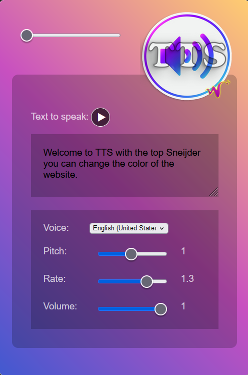

# TTS (NL-nl, EN-us) FireFox add-on

NL
-
Als je een add-on wilt toevoegen aan Mozilla Firefox via de "about:debugging" pagina, volg dan de onderstaande stappen:

Stap 1: Open Firefox
Zorg ervoor dat je de nieuwste versie van Mozilla Firefox hebt geïnstalleerd en open de browser op je computer.

Stap 2: Navigeer naar "about:debugging"
Typ "about:debugging" in de adresbalk van Firefox en druk op Enter. Hiermee ga je naar de debuggingspagina van Firefox.

Stap 3: Kies een optie om een add-on toe te voegen
Op de "about:debugging" pagina zijn er twee opties om een add-on toe te voegen:

"Deze Firefox inschakelen" - Hiermee kun je een add-on installeren vanaf je lokale systeem. Klik op de knop "Deze Firefox inschakelen".

"Tijdelijke add-on laden" - Hiermee kun je een add-on tijdelijk laden vanaf je computer zonder het te installeren. Klik op de knop "Tijdelijke add-on laden".

Stap 4: Selecteer het add-on bestand
Als je hebt gekozen voor de optie "Deze Firefox inschakelen", wordt er een bestandskiezer geopend. Navigeer naar het bestand van de add-on die je wilt installeren op je computer en klik op "Openen" om de add-on te laden.

Als je hebt gekozen voor de optie "Tijdelijke add-on laden", wordt er een bestandskiezer geopend. Navigeer naar het bestand van de add-on die je tijdelijk wilt laden op je computer en klik op "Openen" om de add-on tijdelijk te laden.

Stap 5: Bevestig de add-on
Na het laden van de add-on wordt er een bevestigingsbericht weergegeven op de "about:debugging" pagina. De add-on wordt nu toegevoegd aan je Firefox-browser.

Opmerking: Het toevoegen van add-ons via "about:debugging" is bedoeld voor ontwikkelaars en gevorderde gebruikers en kan riskant zijn. Zorg ervoor dat je add-ons installeert van vertrouwde bronnen en begrijp de risico's voordat je add-ons toevoegt via "about:debugging".

(about:debugging#/runtime/this-firefox)

EN-US
-
If you want to add an add-on to Mozilla Firefox via the "about:debugging" page, follow these steps:

Step 1: Open Firefox
Make sure you have the latest version of Mozilla Firefox and open the browser on your computer.

Step 2: Navigate to "about:debugging"
Type "about:debugging" in the Firefox address bar and press Enter. This will take you to the Firefox debugging page.

Step 3: Choose an option to add an add-on
On the "about:debugging" page there are two options to add an add-on:

"Enable this Firefox" - allows you to install an add-on from your local system. Click the "Enable this Firefox" button.

"Load temporary add-on" - allows you to temporarily load an add-on from your computer without installing it. Click the "Load temporary add-on" button.

Step 4: Select the add-on file
If you chose the "Enable this Firefox" option, a file picker will open. Navigate to the file of the add-on you want to install on your computer and click "Open" to load the add-on.

If you chose the "Load temporary add-on" option, a file picker will open. Navigate to the file of the add-on you want to temporarily load on your computer and click "Open" to temporarily load the add-on.

Step 5: Confirm the add-on
After loading the add-on, a confirmation message is displayed on the "about:debugging" page. The add-on will now be added to your Firefox browser.

Note: Adding add-ons via "about:debugging" is intended for developers and advanced users and can be risky. Be sure to install add-ons from conflicting sources and understand the risks before removing add-ons via "about:debugging".

(about:debugging#/runtime/this-firefox)
